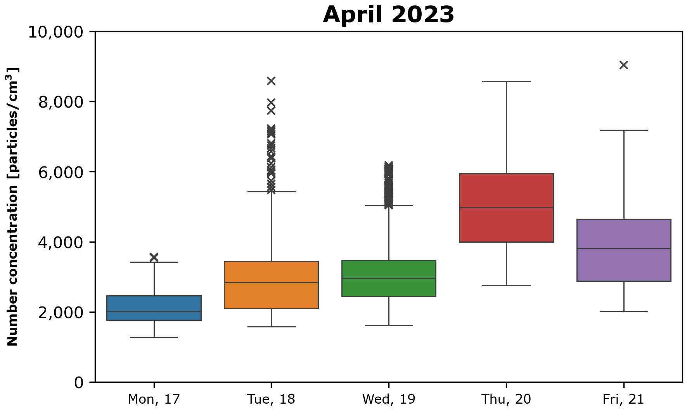

# MINI-WRAS Analysis
[](https://github.com/psf/black)


This repository contains Python scripts designed to analyze and visualize **particles (or nanoparticles) number and mass concentration** data obtained from GRIMM MINI-WRAS 1.371 (Wide-Range Aerosol Spectrometer).

▼ **Check out the demo video below!**

https://github.com/user-attachments/assets/b2ac4c47-1ade-4d77-9316-55adf142c032

> [!NOTE]
> In the demo video, `python project.py` was the only command available, but after numerous updates and new features, the project now includes multiple commands—this old command now corresponds with `python number_concentration_filewise.py`. Please refer to the [Usage](#usage) section for the latest details.

The directory and file information are stored and managed efficiently using a recursive tree structure implemented through the `directory_tree()` function, enabling quick access and exploration of the directory hierarchy. It was used to practice directory handling, however there is an opportunity for improvement by leveraging Python's `pathlib` library. Data from the `sample-data` folder can be used as an example.

**Feel free to use and customize it to analyze your own data!**

## Prerequisites

Ensure you have [Python](https://www.python.org/) installed on your machine. Additionally, install the required libraries by running:

```bash
pip install pandas matplotlib seaborn
```

## Usage

1. Clone this repository to your local machine:

    ```bash
    git clone https://github.com/aokolowicz/mini-wras-analysis.git
    ```

2. Navigate to the repository folder:

    ```bash
    cd mini-wras-analysis
    ```

3. Indicate the path to the data that should be analyzed by changing the `path` variable in the `helpers.py` file.

4. **`number_concentration_filewise.py`**

    To get a plot like the one below, run the script  by selecting the appropriate keyword and file extension within the `list_files()` function. For example, use `list_files(dir_tree, 'day', 'C.dat')` to specify the directory tree `dir_tree`, filter files by the keyword `'day'`, and limit results to files with the `'C.dat'` extension.

    ```bash
    python number_concentration_filewise.py
    ```

<p align="center">
    
    
</p>

> [!IMPORTANT]  
> Before using other scripts that require merged data use the specified script first. After that, scripts that require merged data can be used.
> ```bash
> python merge-mini-wras-data.py [-p]
> ```

5. **`boxplots.py [OPTIONS]`**

    To get boxplots like the ones below, run the script by selecting the appropriate flag.

    ```bash
    python boxplots.py [-d] [-m] [-n] [-s]
    ```
<p align="center">
    
    <br>
    
    
</p>

6. **`distribution.py [OPTIONS]`**

   To get number/mass particle size distribution (PSD) like the one below, run the script by selecting the appropriate flag.

    ```bash
    python distribution.py [-k] [-m] [-s]
    ```
<p align="center">
    
    
</p>

7. You will be prompted regarding saving the generated figures.


## File Structure

- `helpers.py`: Useful functions and constants.
- `sample-data/`: Directory containing sample data files.
- `merge-mini-wras-data.py`: MINI-WRAS data merging - `C.dat` (particle number concentration) and `M.dat` (particulate matter mass concentration)
- `number_concentration_filewise.py`: Particle and nanoparticle number concentration data visualization. Saving to the folders with data filewise.
- `boxplots.py`: Particle (or nanoparticle) number or mass concentration data on boxplots per months or days.
- `distribution.py`: Number or mass particle size distribution (PSD) visualization for the data after merging or each file filtered by a specified keyword. 

## How to contribute?

Feel free to contribute by opening an issue or submitting a pull request.

## License

This project is licensed under the [MIT License](LICENSE).
